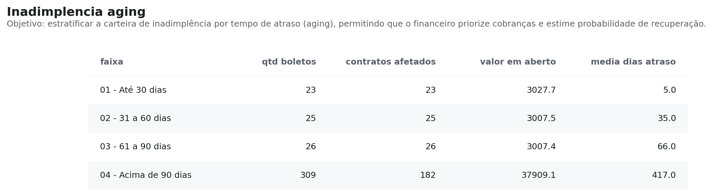
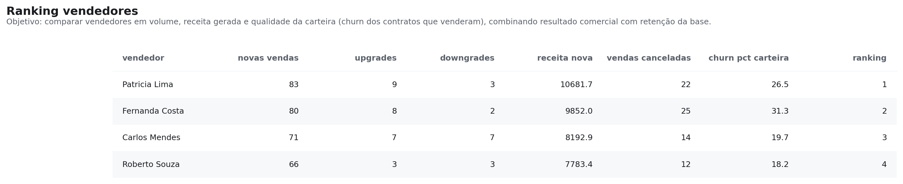

# SQL Analytics Pack — FiberNet ISP

<div align="center">


**10 queries analíticas aplicadas a um ISP fictício (FiberNet) com 300 clientes.**  
Churn por plano, cohort de retenção, aging de inadimplência, scoring de risco e crescimento de MRR — Window Functions, CTEs e PostgreSQL 14+.

[Ver Queries](#-queries) · [Ver Insights](analysis/findings.md) · [Como Rodar](#-como-rodar)

</div>

> Peça do portfólio de **Hugo Leonardo**, Analista de Dados — cada projeto, com o contexto de por que foi feito, está em **[hugoleonardonz.github.io/portfolio](https://hugoleonardonz.github.io/portfolio/)**.

---

## Universo FiberNet — Escala Canônica

Os 3 projetos desta série representam a **mesma empresa fictícia** em granularidades complementares:

| Granularidade | Projetos | Escala | Abrangência |
|---|---|---|---|
| **Amostra Regional** | SQL Analytics Pack | 300 contratos | Centro-MG: Betim, Contagem, Ribeirão das Neves, Esmeraldas, Ibirité |
| **Base de Modelagem** | Churn Predictor | 15.000 contratos | 5 regiões · planos até Empresarial |
| **Visão Operacional Nacional** | Telecom KPI Dashboard | 88.501 clientes (jan/25) | 5 regiões nacionais (Norte, Sul, Leste, Oeste, Centro) |

A divergência de escala é **intencional**: o SQL Pack mergulha numa amostra pequena, onde dá para conferir cada linha na mão. Modelo precisa de volume, então o Churn Predictor gera 15.000 contratos. O KPI Dashboard consolida a operação inteira.

**O que essas bases NÃO são: a mesma tabela.** Cada projeto gera a sua, com o seu gerador. O padrão de negócio se repete — plano de menor ticket cancela mais, atraso e insatisfação antecipam a saída — mas o número exato de um não vale como conferência do outro. O `churn-predictor` chegou a fixar as taxas de churn do app nos valores que a query 02 do SQL Pack devolve, e a coincidência costurada à mão era apresentada como prova de coerência da série.

---

## Contexto de Negócio

A **FiberNet** é um ISP fictício baseado na estrutura real de um provedor de fibra óptica.  
O dataset é sintético, mas modela desafios genuínos do setor:

- **Alta rotatividade em planos básicos** — Fibra 100MB cancela 3,6× mais que o Fibra 1GB
- **Inadimplência de difícil recuperação** — 80,7% do saldo aberto já ultrapassa 90 dias
- **Concentração geográfica** — 3 cidades respondem por 73% do MRR total
- **Qualidade de carteira variável** — spread de 13pp de churn entre o melhor e o pior vendedor

---

## Estrutura

```
sql-analytics-pack/
│
├── README.md
├── data/
│   ├── schema.sql          ← 7 tabelas: clients, contracts, plans, sellers,
│   │                          financial_receivables, tickets, sales
│   └── seed.sql            ← 300 clientes · 4.241 boletos · 220 tickets (2022–2024)
├── queries/
│   ├── 01_receita_por_cidade.sql
│   ├── 02_churn_por_plano.sql
│   ├── 03_cohort_clientes.sql
│   ├── 04_ranking_vendedores.sql
│   ├── 05_inadimplencia_aging.sql
│   ├── 06_ticket_medio_por_plano.sql
│   ├── 07_crescimento_mensal.sql
│   ├── 08_clientes_em_risco.sql
│   ├── 09_tempo_medio_cancelamento.sql
│   └── 10_top_cidades_churn.sql
├── models/                 ← os mesmos recortes como modelos dbt (staging + marts)
├── tools/
│   └── run_query.py        ← roda qualquer query em DuckDB, sem servidor
├── docs/img/               ← resultados exportados pelo run_query.py
└── analysis/
    └── findings.md         ← resultados verificados com o seed + interpretação de negócio
```

---

## Queries

| # | Arquivo | Técnicas SQL | Pergunta de Negócio |
|---|---------|--------------|---------------------|
| 01 | [receita_por_cidade](queries/01_receita_por_cidade.sql) | `SUM`, `AVG`, `OVER()` | Onde está concentrada a receita? |
| 02 | [churn_por_plano](queries/02_churn_por_plano.sql) | CTE, `FILTER`, `NULLIF` | Planos baratos têm mais evasão? |
| 03 | [cohort_clientes](queries/03_cohort_clientes.sql) | `DATE_TRUNC`, `TO_CHAR`, CTE | Qual coorte retém mais clientes? |
| 04 | [ranking_vendedores](queries/04_ranking_vendedores.sql) | `DENSE_RANK`, múltiplos `FILTER` | Quem vende mais *e* com melhor qualidade? |
| 05 | [inadimplencia_aging](queries/05_inadimplencia_aging.sql) | `CASE WHEN`, CTE, aritmética de datas | Quanto ainda dá para recuperar? |
| 06 | [ticket_medio_por_plano](queries/06_ticket_medio_por_plano.sql) | `EXTRACT`, `AGE`, LTV estimado | Qual plano gera mais valor por cliente? |
| 07 | [crescimento_mensal](queries/07_crescimento_mensal.sql) | `FULL OUTER JOIN`, `ROWS BETWEEN` | MRR crescendo ou contraindo? |
| 08 | [clientes_em_risco](queries/08_clientes_em_risco.sql) | Score composto, CTEs encadeadas | Quem priorizar na retenção? |
| 09 | [tempo_medio_cancelamento](queries/09_tempo_medio_cancelamento.sql) | `MODE()`, `EXTRACT`, estatísticas | Quando o cliente desiste? |
| 10 | [top_cidades_churn](queries/10_top_cidades_churn.sql) | `DENSE_RANK`, `FILTER`, múlt. agg. | Quais cidades exigem atenção operacional? |

---

## Principais Resultados

> Números verificados executando as queries contra `data/seed.sql`.  
> Interpretação completa em [`analysis/findings.md`](analysis/findings.md).

### Churn por Plano
| Plano | Mensalidade | Contratos | Churn |
|-------|-------------|-----------|-------|
| Fibra 100MB | R$ 89,90 | 98 | **36,7%** ⚠️ |
| Fibra 200MB | R$ 109,90 | 84 | 26,2% |
| Fibra 500MB | R$ 139,90 | 69 | 14,5% |
| Fibra 1GB | R$ 179,90 | 49 | **10,2%** ✅ |

> Clientes no plano básico cancelam **3,6× mais** que no premium. Upsell reduz churn e aumenta receita simultaneamente.

### MRR por Cidade
| Cidade | Contratos Ativos | MRR | % Receita |
|--------|-----------------|-----|-----------|
| Betim | 63 | R$ 7.833,70 | 27,4% |
| Contagem | 54 | R$ 6.894,60 | 24,1% |
| Ribeirão das Neves | 50 | R$ 6.245,00 | 21,9% |
| Esmeraldas | 37 | R$ 4.456,30 | 15,6% |
| Ibirité | 23 | R$ 3.127,70 | 11,0% |

### Aging de Inadimplência



| Faixa | Boletos | Valor em Aberto | Recuperabilidade |
|-------|---------|-----------------|-----------------|
| Até 30 dias | 23 | R$ 3.027,70 | Alta |
| 31–60 dias | 25 | R$ 3.007,50 | Média |
| 61–90 dias | 26 | R$ 3.007,40 | Baixa |
| **Acima de 90 dias** | **309** | **R$ 37.909,10** | Crítica |
| **Total** | **383** | **R$ 46.951,70** | — |

A leitura está na última linha antes do total: 80,7% do saldo em aberto já
passou de 90 dias.
Isso muda a decisão de cobrança — não é carteira para régua de lembrete, é
carteira para negociação com desconto ou baixa contábil.

### Ranking de vendedores



Volume e qualidade de carteira não andam juntos: a vendedora com mais vendas
novas tem 26,5% de churn na própria carteira, contra 18,2% de quem vendeu menos.
Comissionar só por volume premia quem traz o cliente que sai.

### Resumo Executivo
| Métrica | Valor |
|---------|-------|
| MRR total ativo | R$ 28.557,30 |
| Clientes ativos | 227 / 300 (75,7%) |
| Churn rate médio | 24,3% |
| Contratos com sinal de risco | 174 (76,7% da base) |
| Melhor plano (LTV) | Fibra 500MB — R$ 2.553,77 |
| Cidade maior churn | Contagem (34,1%) |
| Inadimplência crítica (>90d) | R$ 37.909,10 |

---

## Como Rodar

**Pré-requisitos:** PostgreSQL 14+ e psql ou qualquer client SQL (DBeaver, TablePlus, DataGrip).

```bash
# Clone
git clone https://github.com/HugoLeonardoNz/SQL-Analytics-Pack.git
cd SQL-Analytics-Pack

# Crie o banco e carregue schema + dados
psql -U postgres -c "CREATE DATABASE fibernet;"
psql -U postgres -d fibernet -f data/schema.sql
psql -U postgres -d fibernet -f data/seed.sql

# Rode qualquer query
psql -U postgres -d fibernet -f queries/02_churn_por_plano.sql
```

**Sem PostgreSQL instalado?** O pacote roda em memória, sem servidor:

```bash
pip install duckdb pandas matplotlib

python tools/run_query.py                # lista as 10 queries
python tools/run_query.py 05             # imprime o resultado
python tools/run_query.py 05 --png docs/img/aging.png   # gera a imagem
```

O DuckDB lê **o mesmo** `data/schema.sql` e **o mesmo** `data/seed.sql`, e as
queries não são reescritas — se precisassem ser, o exercício perderia a graça.
A única adaptação está na carga: `SERIAL` vira `INTEGER` e as chamadas de
`setval` saem, porque sem sequência não há sequência para reposicionar. As
imagens deste README são geradas por esse script, não recortadas da tela.

Alternativa sem instalar nada: [DB Fiddle](https://www.db-fiddle.com)
(PostgreSQL 14) — cole `schema.sql` + `seed.sql` em **Schema SQL**, a query em
**Query SQL** e clique em **Run**.

---

## Técnicas Utilizadas

```sql
-- Window Functions
DENSE_RANK() OVER (ORDER BY receita_nova DESC)
SUM(mrr) OVER (ORDER BY mes ROWS BETWEEN UNBOUNDED PRECEDING AND CURRENT ROW)

-- CTEs encadeadas
WITH overdue AS (...),
     classified AS (SELECT *, CASE WHEN dias > 90 THEN 'crítico' END AS faixa FROM overdue)
SELECT ... FROM classified

-- Agregações avançadas
MODE() WITHIN GROUP (ORDER BY motivo_cancelamento)
COUNT(*) FILTER (WHERE status = 'cancelled')
EXTRACT(MONTH FROM AGE(cancellation_date, start_date))

-- Joins analíticos
FULL OUTER JOIN  -- combinar MRR novo + cancelado por mês
LEFT JOIN        -- score de risco composto com múltiplas fontes
```

---

---

## Os achados publicados são testados

```bash
pip install -r requirements-dev.txt
pytest tests/ -v
```

Número em README não executa — e foi exatamente por isso que este portfólio deixou
texto e código divergirem em silêncio mais de uma vez. Num dos repositórios, um
comentário explicava que 87,0% era número inventado e o gráfico sessenta linhas
abaixo plotava 87,0%. Em outro, o texto dizia "São Paulo tem a melhor taxa do país"
enquanto o CSV ao lado registrava que era o 5º.

O `dbt test` cobre o **modelo** (chaves, nulos, valores aceitos). Esta suíte cobre
as **conclusões**: Betim com 27,4% da receita, o plano básico em 36,7% de churn com
a escada inteira monotônica, R$ 37,9 mil vencidos há mais de 90 dias, Contagem como
cidade de maior churn. São coisas diferentes — o schema pode estar íntegro e o texto
continuar citando um número que a query deixou de devolver.

Roda via DuckDB, sobre o mesmo `schema.sql` e o mesmo `seed.sql` do PostgreSQL, sem
reescrever nenhuma query: reescrever verificaria outra coisa.

Se o gerador, a fonte ou a limpeza mudarem, o teste falha e obriga a atualizar o
texto. É a mesma regra que vale para dado: **ou se deriva de uma fonte só, ou se
escreve um teste que falha quando as duas divergirem.**

## Autor

**Hugo Leonardo**  
Analista de Dados Pleno — SQL · Python · Power BI

[](https://www.linkedin.com/in/hugo-leonardo-data-analyst/)
[](https://github.com/HugoLeonardoNz)

---

<div align="center">
<sub>Dataset 100% sintético gerado para fins de portfólio. Nenhuma informação real de clientes foi utilizada.</sub>
</div>
